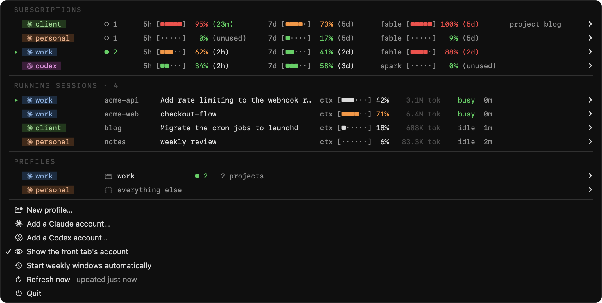
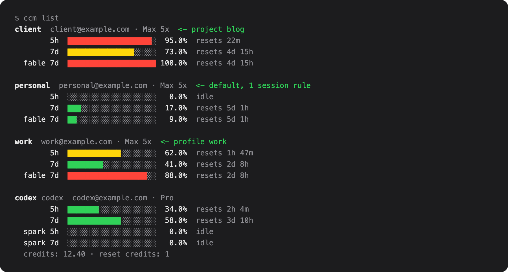

# claude-code-accounts

Several Claude Code subscriptions on one Mac. See what is left on each, and
decide which one pays for each project, each group of projects, or each
terminal. Also tracks OpenAI Codex subscriptions beside them.

Two ways in: the `ccm` command, and a macOS menu bar app that shows every
subscription's usage windows, every running session and what it spends, and
lets you move a session to another account in one click.

Status: early, macOS only, used daily by its author. Expect rough edges.

[](https://github.com/ryanhu22/claude-code-accounts/actions/workflows/ci.yml)

<p align="center">
  
</p>
<p align="center">
  
</p>

The screenshots come from `scripts/demo.py`, which runs the app on made-up
accounts. Nothing in them is a real account, email address or path.

## Read this first

This is an independent project. It is not affiliated with, endorsed by, or
supported by Anthropic or OpenAI. Claude, Claude Code and the Claude mark are
trademarks of Anthropic, PBC. OpenAI, ChatGPT, Codex and the OpenAI logo are
trademarks of OpenAI. They appear in this tool only to say which service an
account belongs to.

Know what you are running:

- This tool reads and moves your own sign-in credentials: the keychain items
  Claude Code writes and the `auth.json` file the Codex CLI writes. It calls
  endpoints those tools use internally. Those endpoints are not documented and
  can change or disappear without notice.
- Anthropic's terms for Claude Code say that OAuth sign-in is for Claude Code
  and Anthropic's own applications, that third-party developers may not
  collect, store or intermediate Claude.ai credentials or session tokens, and
  that requests may not be routed through Free, Pro or Max plan credentials.
  Three parts of this tool do that with your own accounts: `ccm login`,
  `ccm poke` and its automatic mode, and the credential copying that lets a
  running session change account without a restart. Anthropic says it may enforce these restrictions
  without notice. Using those parts can put your Claude account at risk. Read
  the terms yourself: https://code.claude.com/docs/en/legal-and-compliance
- The Codex CLI is open source, and OpenAI maintainers have said that forks
  and tools like this are allowed under its terms. This tool reads the file
  the Codex CLI writes and signs in with the same flow the CLI uses. OpenAI's
  terms still apply to your account.
- To stay well inside both sets of rules, use only the routing and session
  features, sign in through Claude Code itself (`ccm add <name>` prints the
  command), and do not use `ccm login` or `ccm poke` for Claude accounts.

You use this software at your own risk. See the MIT license.

## Why

Claude Code keeps one login per config directory, so several subscriptions
can coexist on one machine. Nothing tells you how much of each is left, which
project is spending which one, or how to move a project off an exhausted
account.

Most tools that solve this switch the active account for the whole machine.
This one starts from a different question. Which account pays for a piece of
work is a property of the work, not of the terminal you happen to be sitting
in. So you write rules: this repository uses the work account, these three
repositories share the client account, this one terminal uses the personal
account for the afternoon. Every launch follows the rules, and a rule change
reaches the sessions that are already running.

## What you get

**The menu bar app**

- Every subscription with its 5-hour, 7-day and model-scoped windows, each
  with the time until it resets. The one you choose, or the one behind the
  front terminal tab, is drawn in the menu bar itself.
- Every running session: which account it spends, which rule chose it, how
  full its context window is, and what it has spent over its whole life.
- One click moves a session, its project, or its whole profile to another
  account. Running sessions follow within about thirty seconds.
- Sign in, rename, recolour and remove accounts. Start an idle account's
  5-hour window so it lines up with when you want it.

**The command line**

```sh
ccm list                          # usage for every subscription
ccm sessions                      # every running session and what pays for it
ccm use acme                      # this repository uses acme
ccm use acme --profile work       # every repository in the work profile
ccm use acme --session            # this terminal only
ccm where                         # what this directory resolves to, and why
```

<p align="center">
  
</p>

## Install

Requirements:

- macOS 13 or newer.
- Python 3.10 or newer. `uv` is recommended.
- Claude Code 2.1.224 or newer, which keys keychain items per config directory.
- The Codex CLI, only if you track Codex accounts.

Installs come from GitHub. There is no PyPI release yet.

```sh
uv tool install "claude-code-accounts[menubar] @ git+https://github.com/ryanhu22/claude-code-accounts"
```

For the command line alone:

```sh
uv tool install "claude-code-accounts @ git+https://github.com/ryanhu22/claude-code-accounts"
```

### Sign each subscription in

Each account gets a name that is a label for you, not the email:

```sh
ccm login work                    # or --browser "Google Chrome"
```

The browser returns the code to a local port, so there is nothing to copy.
The sign-in page is asked to land on the account that this name last held,
because switching account part way through is what loses the code. `--paste`
falls back to typing the code in, and so does the app if nothing can listen
locally.

Which browser matters. The sign-in uses whichever account that browser is
already logged into, and with several subscriptions that is exactly how the
wrong one gets attached to a name. The app and the CLI both let you pick the
browser, and a sign-in that lands on a different account than the name held
before says so.

To sign in through Claude Code itself instead, `ccm add work` prints the
command to run.

### Let the shell pick the account

Add to `.zshrc`:

```sh
eval "$(ccm shell-init)"
```

This defines a `claude` function that resolves the right config directory
before it launches the real binary. It is deliberately small: the routing
logic lives in a generated script, so a terminal opened weeks ago is never
more than one line behind.

### Start the menu bar app at login

```sh
ccm menubar install
```

This writes a launch agent for `ccm-menubar` into `~/Library/LaunchAgents`,
starts it now, and starts it at every login. `ccm menubar uninstall` removes
it. To run the app once without installing anything, run `ccm-menubar`. The
plist it writes is `packaging/com.claude-code-accounts.plist` with your paths
filled in, if you would rather install it by hand.

## Which account a session uses

Four rules, most specific first:

| scope | reaches | set with |
|---|---|---|
| session | one terminal | `ccm use <account> --session` |
| project | one repository and its worktrees | `ccm use <account>` |
| profile | every repository in a named group | `ccm use <account> --profile <name>` |
| default | everything no rule covers | `ccm use <account> --default` |

A **profile** is a named list of repositories that share a subscription, so
"put all my work repositories on this account" is one rule and not one per
repository.

```sh
ccm profiles                      # every rule, least specific first
ccm profile new work
ccm profile add work              # put this repository in it
ccm use acme --profile work       # move the whole group
ccm where                         # what this directory resolves to, and why
```

A worktree resolves to its parent checkout first, so it inherits the
repository's rule even when it lives outside the repository directory.

A choice you make now outranks a narrower one you made earlier. Pointing a
project at an account releases the session rules of the terminals running in
it, so every session in that project moves together. A profile choice does
the same for its repositories that have no project rule of their own, and the
default for everything under no rule. A session rule whose terminal is gone is
dropped on its own.

Account names take any unique prefix or substring, so `ccm use wo` finds
`work`.

Everything here is in the menu bar too. Each session row offers the same
three scopes, and a PROFILES section shows which account each group uses.

## A change reaches running sessions

A session re-reads its keychain item about every thirty seconds, so a rule
change lands without a restart. Measured, by pointing a live session's
directory at a credential that could only fail:

```
msg1 (real credential)   is_error=False  'one'
credential replaced with garbage tokens
msg@35s                  is_error=True   'Failed to authenticate: ...'
```

This is what per-session config directories are for. Each terminal gets its
own directory, so writing a credential into one moves that session and
nothing else. Sessions started before they had one are the exception. There
is nowhere to write that only they would see, so those still need a restart.
Their row says so and offers to bring that terminal tab to the front.

The `/usage` panel can show the previous account for a few minutes after a
move. Claude Code's usage endpoint limits requests per account. When it refuses
a request, Claude Code shows the last numbers from the previous account with
a small "rate limited" note. The first message the session sends on the new
account corrects the panel because Claude Code rebuilds it from that response.
ccm keeps the session's recorded identity (`oauthAccount` in its `.claude.json`)
in step with its credential. This makes `/status` name the right account and
drops stale cached usage.

Switching accounts invalidates the prompt cache, which is keyed per account
and per model, so the first turn after a move re-sends the conversation. That
is once per move, not per turn, and cheapest right after `/clear` or
`/compact`.

### Keeping the copies alive

Several directories holding one account means several copies of one refresh
token, and a refresh token is single use: whichever session refreshes first
spends it for the rest. The app's three-minute usage poll refreshes tokens
with less than thirty minutes left and hands the successor to every copy in
one pass. This gives it a head start on Claude Code, which refreshes about
five minutes before expiry, or a tool run's timeout plus five minutes before
a long run. Every 45 seconds the app also takes the newest credential of each
lineage, whoever produced it, and hands it to the copies that are behind. A
session left holding a spent token recovers on its own, because of that same
thirty-second re-read.

The account's own directory is authoritative. A session copy is promoted over
it only when it is newer *and* the API confirms it belongs to the same
account. A directory that has not caught up with a rule change is holding a
different login, and copying that around would mix two accounts together.
Every write re-checks under Claude Code's own locks, so a rotation that lands
between a read and a write is never overwritten.

## The other commands

```sh
ccm list                  # usage for every subscription
ccm sessions              # every running session and what pays for it
ccm poke <account>        # spend one token to start that account's 5h window
ccm reset <account>       # spend one Codex reset credit: every window back to 0%
ccm unpin                 # drop this terminal's rule
ccm add <name>            # print the command that signs an account in
ccm menubar install       # start the menu bar app at every login
```

`ccm shell-init` also defines short aliases: `subs`, `ccwhoami`, `ccsessions`,
`ccprofiles`, `ccuse`, `ccpin` and `ccunpin`, plus `ccresume` and `ccpick`
for `claude -c` and `claude --resume` in the right directory.

### Poking

A weekly reset leaves an account at 0% with no window running, because the
5-hour window starts on first use. `ccm poke` starts it deliberately, for
about 22 input tokens, so the window lines up with when you want it. A
model-scoped window only starts on a request to that model, so a poke sends
one request per window that has no clock.

The menu bar app can do this for you. Turn on **Start weekly windows
automatically** in its menu, or run `ccm auto-start on`. Every time usage is
refreshed, an account whose 7-day window or model-scoped weekly window has no
clock gets one request, at most once an hour per account. It is off by
default, because it sends requests on your behalf, and it runs only while the
menu bar app is running. The request that starts a weekly window starts the
5-hour window too. Codex accounts are not started automatically yet: that
needs a request to the Codex backend, which this tool does not send.

## Codex accounts

`ccm list` also tracks OpenAI Codex subscriptions: plan, usage windows,
credits and reset credits. Sign another account in through the browser:

```sh
ccm login <name> --codex
```

A reset credit puts every window of a Codex account back to 0%. OpenAI grants
them now and then, and they expire. To spend one, open the account in the menu
bar and choose "Reset every window now", or run `ccm reset <account>`. The
credit that expires first is the one spent. It sends the same request the
Codex CLI sends when it offers a reset, and it cannot be undone.

The login already in `~/.codex` appears as `codex`, through a symlink rather
than a second copy of its refresh token. Each additional account owns a
`CODEX_HOME` at `~/.codex-accts/<name>` with only `auth.json` of its own.
Everything else links back to `~/.codex`, so settings and history stay shared.

Windows differ by plan. Pro Lite has a weekly window only; plans with a
5-hour window show that too. Routing Codex accounts is not supported yet.

## How it works

### One config directory per account

Each account owns `~/.claude-accts/<name>`, and that is where sessions run.
Settings, commands and `projects/` symlink back to `~/.claude`, so every
account shares one set of them and `claude -c` finds the same history
whichever subscription is paying.

This is what makes a rule change cheap. A rule names an account, so pointing
a project elsewhere rewrites one line. No credential is copied, nothing can be
half-written, and there is never a second copy of a login to fall out of sync.

Per-project settings follow the project. `.claude.json` keeps trust, allowed
tools and MCP servers under the project's path, so that entry is copied across
and a move does not ask for trust again.

The answers Claude Code asks once follow the user instead. Folder trust and the
Claude in Chrome onboarding are shared across every directory, so answering in
one session answers for all of them, and a new session starts out trusting the
folders you already trusted. Turning the browser tools on or off in any session
sets them the same way everywhere.

Rules live in `~/.claude-manager/config.json`. Claude Code only understands
`CLAUDE_CONFIG_DIR`, and the shell must resolve a directory before it can
launch anything, so the rules are also flattened into a grep-able
`routes.conf` on every change. If this tool is broken or missing, the last
table still works.

### A credential is never invented

Signing in is an OAuth PKCE flow against `platform.claude.com`, asking for the
same scopes a real Claude Code login carries. Every field of the stored
credential comes from the token response or from `/api/oauth/profile`, and the
result is checked against the live API before it is written.

A credential missing `subscriptionType` or `rateLimitTier` still
authenticates, but Claude Code then opens the session as "API Usage Billing"
instead of the plan you pay for. So a sign-in that cannot read back its own
identity and plan is refused rather than saved. A login that half works is
harder to diagnose than one that never happened.

### Credential writes take Claude Code's locks

Claude Code guards its own token refresh with `proper-lockfile` directory
locks: `<config dir>/.oauth_refresh.lock`, then the legacy sibling
`<config dir>.lock`. A refresh that lands inside its window rotates the token
twice, and whichever copy keeps the spent one fails its next refresh and looks
signed out. So every credential write here holds the same locks and re-reads
under them, and a rotated token is pushed to any other copy of the same
generation. The protocol was documented by
[claude-swap](https://github.com/realiti4/claude-swap), verified against the
Claude Code 2.1.218 bundle.

### A failed request is never a broken login

Only the server refusing a token says anything about a login: a 401 or 403 on
the profile endpoint, or an RFC 6749 `invalid_grant` on refresh. A rate limit
or a network failure falls back to the last known answer.

That matters because these endpoints are rate limited per account, and running
sessions poll them too, so the busiest account is the one whose requests fail.
Identity is cached against the credential's fingerprint (an account cannot
change while its credential does not) and carried across rotations, so the
steady state asks nothing. Usage is cached with a per-account backoff, and a
429 serves the last payload rather than blanking the row. Reset times in it
are absolute, so a cached row still counts down.

### What a session row says

Sessions come from Claude Code's own registry, `<config dir>/sessions/<pid>.json`,
which carries the pid, cwd, status and the name it shows for the session. That
also catches config directories reached through a path alias: Claude Code keys
the keychain on the path *string*, so a symlink and its target are two logins.

Claude Code names a session `<repo>-<hash>` until it has something better, so
a row prefers the branch for a worktree (which is also *which* worktree), then
a name that was chosen deliberately, then the title Claude Code wrote for the
conversation.

The `ctx` bar is how full the session's context window is, from the last
request it made. Beside it is what the session has spent over its whole life,
counted incrementally: a transcript is append-only, so each pass resumes from
the byte the last one stopped at, and the offset is kept on disk. Ten sessions
over 200MB of transcripts cost 0.36s cold and nothing after. The submenu
breaks the total into four figures, because a cache read costs a fraction of a
fresh input token and dominates a long conversation.

### What it costs to run

Every keychain read is one `security` subprocess, about 15 to 20 ms, and that
is the unit cost that matters. The app reads each credential at most once
every twenty seconds across its polls, reads every credential fresh before it
writes one, and asks the process table once per session rather than once per
poll. `scripts/bench.py` reports the wall time and the keychain calls of every
move, and the test suite pins the exact call count of each so a regression
fails CI.

## Compared with other tools

There are several account switchers for Claude Code, and the usage numbers and
the menu bar are table stakes now. The difference here is what a switch is.

- [claude-swap](https://github.com/realiti4/claude-swap) switches the active
  account for the machine, rotates at rate limits, and documented the lock
  protocol used here. If you want one account at a time and automatic
  rotation, use it.
- Menu bar switchers such as
  [claude-account-switcher](https://github.com/Symbioose/claude-account-switcher)
  swap the active account in one click and can fail over at 100%.
- [claude-code-account-switcher](https://github.com/Nemo-Illusionist/claude-code-account-switcher)
  binds accounts to directories and activates on `cd`, which is the project
  rule here without the profile, session and default levels.

This tool keeps every account signed in at once, decides per project, profile
or terminal, moves sessions that are already running, and never mints a
credential, so every session keeps its real plan and rate-limit tier.

## Notes

- macOS only. Credentials stay in the login keychain, written through
  `security -i` so secrets never reach the process argument list.
- Claude Code 2.1.224+ keys credentials per config directory as
  `Claude Code-credentials-<sha256(config dir)[:8]>`. The older bare item is
  read as a fallback.
- The command is still `ccm`, and the rules still live in `~/.claude-manager`.
  The project was renamed from claude-code-manager; nothing on disk moved.

## Contributing

See [CONTRIBUTING.md](CONTRIBUTING.md) for setup, tests, the latency bench
and pull requests. Tests run against a fake keychain and a fake API, so they
never touch your accounts or the network. `scripts/demo.py menubar` runs the
app on made-up accounts, so you can see every screen without signing anything
in. `scripts/demo.py shots` regenerates the images above from the same data.

## Security

Report vulnerabilities privately. See [SECURITY.md](SECURITY.md).

## License

MIT
