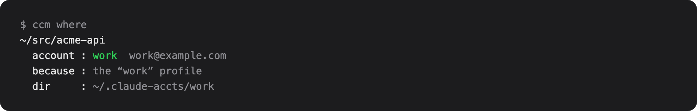
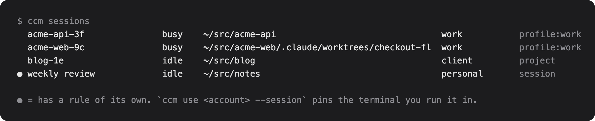

# claude-code-accounts

Several Claude Code subscriptions on one Mac. See what is left on each, and
choose which one pays for each project, each group of projects, or each
terminal. OpenAI Codex subscriptions are tracked beside them.

Two ways in: the `ccm` command, and a macOS menu bar app. The app shows every
account's usage windows and every running session with what it spends, and
moves a session to another account in one click.

Status: early, macOS only, used daily by its author. Expect rough edges.

[](https://github.com/ryanhu22/claude-code-accounts/actions/workflows/ci.yml)

<p align="center">
  
</p>

This is what it looks like in your macOS menu bar:

<p align="center">
  
</p>

## Install with an agent

To have Claude Code, Codex or another coding agent do the install for you,
paste the prompt below into the agent. It works on macOS only. Windows and
Linux are not supported: credentials live in the macOS keychain, the menu bar
app is macOS only, and autostart uses a macOS launch agent.

The prompt stops before the sign-in step. Signing in opens a browser on your
own account, so that step is yours.

````text
Install claude-code-accounts on this Mac. It is a tool that keeps several
Claude Code subscriptions signed in at once and picks which one each project
uses. Repository: https://github.com/ryanhu22/claude-code-accounts

Do these steps in order. Stop and tell me if a check fails.

1. Check the requirements:
   - macOS 13 or newer (`sw_vers -productVersion`). If this is not a Mac,
     stop: the tool does not support Windows or Linux.
   - Python 3.10 or newer (`python3 --version`).
   - `uv` on PATH (`uv --version`). If it is missing, install it with
     `curl -LsSf https://astral.sh/uv/install.sh | sh` and open a new shell.
   - Claude Code 2.1.224 or newer (`claude --version`).

2. Install the tool with the menu bar app:
   uv tool install "claude-code-accounts[menubar] @ git+https://github.com/ryanhu22/claude-code-accounts"
   Then confirm `ccm --help` runs. If `ccm` is not found, run `uv tool
   update-shell` and open a new shell.

3. Add the shell hook. Append this line to ~/.zshrc if it is not already
   there, then tell me to open a new terminal:
   eval "$(ccm shell-init)"
   This defines `claude` and `codex` functions that pick the right config
   directory before launching the real binaries.

4. Start the menu bar app at login:
   ccm menubar install
   Confirm it runs with `launchctl list | grep claude-code-accounts`.

5. Do not sign any account in. For each account I want, run
   `ccm add <name>` and show me the command it prints. I will run those
   commands myself, because each one opens a browser on my own account.
   Do not run `ccm login` or `ccm poke`.

6. When you are done, print: the output of `ccm --version`, the line you
   added to ~/.zshrc, and the `ccm add` commands for me to run. Then tell me to run
   `ccm list` after I have signed in, to see every subscription's usage.
````

The agent needs permission to run `uv`, edit `~/.zshrc` and run
`ccm menubar install`. Review what it changed before you open a new terminal.

To install by hand instead, see [Quick start](#quick-start).

## Read this first

This is an independent project. It is not affiliated with, endorsed by, or
supported by Anthropic or OpenAI. Claude, Claude Code and the Claude mark are
trademarks of Anthropic, PBC. OpenAI, ChatGPT, Codex and the OpenAI logo are
trademarks of OpenAI. They appear in this tool only to say which service an
account belongs to.

Know what you are running:

- **It handles your own credentials.** It reads and moves the keychain items
  Claude Code writes and the `auth.json` file the Codex CLI writes. It calls
  endpoints those tools use internally. Those endpoints are not documented
  and can change or disappear without notice.
- **Three parts of it fall under Anthropic's terms for Claude Code.** The
  terms say that OAuth sign-in is for Claude Code and Anthropic's own
  applications, that third-party developers may not collect, store or
  intermediate Claude.ai credentials or session tokens, and that requests may
  not be routed through Free, Pro or Max plan credentials. `ccm login`,
  `ccm poke` and its automatic mode, and the credential copying that moves a
  running session without a restart all do that with your own accounts.
  Anthropic says it may enforce these restrictions without notice. Using
  those parts can put your Claude account at risk. Read the terms yourself:
  https://code.claude.com/docs/en/legal-and-compliance
- **The Codex side is allowed.** The Codex CLI is open source, and OpenAI
  maintainers have said that forks and tools like this are allowed under its
  terms. This tool reads the file the Codex CLI writes and signs in with the
  same flow the CLI uses. OpenAI's terms still apply to your account.
- **To stay well inside both sets of rules**, use only the routing and
  session features, sign in through Claude Code itself (`ccm add <name>`
  prints the command), and do not use `ccm login` or `ccm poke` for Claude
  accounts.

You use this software at your own risk. See the license.

## Why

Claude Code keeps one login per config directory, so several subscriptions
can coexist on one machine. Nothing tells you how much of each is left, which
project is spending which one, or how to move a project off an exhausted
account.

Most tools that solve this switch the active account for the whole machine.
This one attaches the account to the work instead. You write rules: this
repository uses the work account, these three repositories share the client
account, this one terminal uses the personal account for the afternoon. Every
launch follows the rules, and a rule change reaches the sessions that are
already running.

## What you get

The menu bar app:

- Every account with its 5-hour, 7-day and model-scoped windows, each with
  the time until it resets. The account you choose, or the one behind the
  front terminal tab, is drawn in the menu bar itself.
- Every running session of both tools: which account it spends, which rule
  chose it, how full its context window is, and what it has spent over its
  whole life.
- One click moves a session, its project, or its whole profile to another
  account. Claude Code sessions follow within about thirty seconds. A moved
  Codex session takes effect the next time it starts, because Codex reads its
  login once at startup.
- Sign in, rename, recolour and remove accounts. Start an idle account's
  5-hour window so it lines up with when you want it.

The `ccm` command does all of the same from a terminal. See [Commands](#commands).

<p align="center">
  
</p>

## Quick start

You need:

- macOS 13 or newer.
- Python 3.10 or newer. `uv` is recommended.
- Claude Code 2.1.224 or newer, which keys keychain items per config
  directory.
- The Codex CLI, only if you track Codex accounts.

### 1. Install

Installs come from GitHub. There is no PyPI release yet.

```sh
uv tool install "claude-code-accounts[menubar] @ git+https://github.com/ryanhu22/claude-code-accounts"
```

For the command line alone, drop `[menubar]`:

```sh
uv tool install "claude-code-accounts @ git+https://github.com/ryanhu22/claude-code-accounts"
```

### 2. Sign each account in

Each account gets a name. The name is a label for you, not the email.

The safe way is through Claude Code itself. `ccm add work` prints the
command to run.

The other way is `ccm login`, which signs in through your browser. It is one
of the parts covered by the terms note above.

```sh
ccm login work                    # or --browser "Google Chrome"
```

The browser returns the code to a local port, so there is nothing to copy.
The sign-in page is asked to land on the account that this name last held,
because switching account part way through is what loses the code. `--paste`
falls back to typing the code in, and so does the app if nothing can listen
locally.

Which browser matters. The sign-in uses whichever account that browser is
already logged into, and with several subscriptions that is exactly how the
wrong one gets attached to a name. The app and the `ccm` command both let you
pick the browser, and a sign-in that lands on a different account than the
name held before says so.

### 3. Let the shell pick the account

Add this line to `.zshrc`:

```sh
eval "$(ccm shell-init)"
```

This defines a `claude` function that resolves the right config directory
before it launches the real binary, and a `codex` function that resolves the
right `CODEX_HOME` the same way. Both are small on purpose: the routing logic
lives in a generated script, so a terminal opened weeks ago is never more than
one line behind. To see what a directory resolves to, run `ccm resolve` or
`ccm resolve --codex`.

### 4. Start the menu bar app at login

```sh
ccm menubar install
```

This writes a launch agent for `ccm-menubar` into `~/Library/LaunchAgents`,
starts it now, and starts it at every login. `ccm menubar uninstall` removes
it. To run the app once without installing anything, run `ccm-menubar`. If
you would rather install it by hand, the plist it writes is
`packaging/com.claude-code-accounts.plist` with your paths filled in.

### 5. Check

```sh
ccm list                          # usage for every account
ccm use work                      # this repository uses work
ccm where                         # what this directory resolves to, and why
```

## Which account a session uses

Four rules, most specific first:

| scope | reaches | set with |
|---|---|---|
| session | one terminal | `ccm use <account> --session` |
| project | one repository and its worktrees | `ccm use <account>` |
| profile | every repository in a named group | `ccm use <account> --profile <name>` |
| default | everything no rule covers | `ccm use <account> --default` |

A **profile** is a named list of repositories that share an account, so "put
all my work repositories on this account" is one rule and not one per
repository.

```sh
ccm profiles                      # every rule, least specific first
ccm profile new work
ccm profile add work              # put this repository in it
ccm use acme --profile work       # move the whole profile
ccm where                         # what this directory resolves to, and why
```

<p align="center">
  
</p>

Some details that matter once you have more than one rule:

- A worktree resolves to its parent checkout first, so it inherits the
  repository's rule even when it lives outside the repository directory.
- A choice you make now outranks a narrower one you made earlier. Pointing a
  project at an account releases the session rules of the terminals running
  in it, so every session in that project moves together. A profile choice
  does the same for its repositories that have no project rule of their own,
  and the default for everything under no rule.
- A session rule whose terminal is gone is dropped on its own.
- Account names take any unique prefix or substring, so `ccm use wo` finds
  `work`.
- Every scope can name one Claude account and one Codex account at the same
  time, and the provider follows the account that you pick.

Everything here is in the menu bar too. Each session row offers the same
three scopes, and a PROFILES section shows which account each profile uses.

## Moving a running session

A session re-reads its keychain item about every thirty seconds, so a rule
change lands without a restart. Measured, by pointing a live session's
directory at a credential that could only fail:

```
msg1 (real credential)   is_error=False  'one'
credential replaced with garbage tokens
msg@35s                  is_error=True   'Failed to authenticate: ...'
```

This is what per-session config directories are for. Each terminal gets its
own directory, so writing a credential into one moves that session and
nothing else. Sessions started before they had one are the exception. There
is nowhere to write that only they would see, so those still need a restart.
Their row says so and offers to bring that terminal tab to the front.

A moved Codex session takes effect when Codex next starts in that terminal,
because Codex reads its login at start and keeps it. See
[Codex accounts](#codex-accounts) for the one-click restart.

What to expect right after a move:

- **The `/usage` panel can show the previous account for a few minutes.**
  Claude Code's usage endpoint limits requests per account. When it refuses a
  request, Claude Code shows the last numbers from the previous account with
  a small "rate limited" note. The first message the session sends on the new
  account corrects the panel, because Claude Code rebuilds it from that
  response.
- **`/status` names the right account.** ccm keeps the session's recorded
  identity (`oauthAccount` in its `.claude.json`) in step with its
  credential, which also drops stale cached usage.
- **The first turn after a move re-sends the conversation.** The prompt
  cache is keyed per account and per model, so switching accounts
  invalidates it. That is once per move, not per turn, and cheapest right
  after `/clear` or `/compact`.
- **A session that says `out` in red needs `/login`.** The server revoked
  that login. Claude Code clears the dead token from that directory and then
  stops reading it, so the working login the app writes there afterwards
  never arrives. Run `/login` in that tab, or press ctrl+C twice and run
  `claude -c`. Nothing else in the app can reach it.

`ccm log` prints what has happened to the credentials: every refresh, every
copy handed out, and every login the server revoked, with a fingerprint of
each generation and no tokens. The file is `~/.claude-manager/credentials.log`.

## Commands

| command | what it does |
|---|---|
| `ccm list` | usage for every account |
| `ccm sessions` | every running session and what pays for it |
| `ccm where` | what this directory resolves to, and why |
| `ccm use <account>` | this repository uses the account |
| `ccm use <account> --profile <name>` | every repository in the profile |
| `ccm use <account> --session` | this terminal only |
| `ccm use <account> --default` | everything no rule covers |
| `ccm swap ...` | the same as `ccm use` |
| `ccm pin <account>` | give this terminal its own account |
| `ccm unpin` | drop this terminal's rule (`--codex` for the Codex one) |
| `ccm profiles` | every rule, least specific first |
| `ccm profile new / add / drop / rename / rm <name>` | create and edit profiles (`--path` names a repository other than this one) |
| `ccm add <name>` | print the command that signs an account in through Claude Code (`--codex` for Codex) |
| `ccm login <name>` | sign an account in through the browser (`--browser`, `--paste`, `--codex`) |
| `ccm poke <account>` | spend a few tokens to start that account's stopped windows (`--weekly` for weekly windows only) |
| `ccm auto-start on` | start weekly windows automatically while the app runs (`off` to stop) |
| `ccm reset <account>` | spend one Codex reset credit: every window back to 0% (`-y` skips the prompt) |
| `ccm resolve` | print the config directory for this shell (`--codex` for `CODEX_HOME`) |
| `ccm shell-init` | print the shell wrapper to eval in your rc file |
| `ccm menubar install` | start the menu bar app at every login (`uninstall` to stop) |
| `ccm log` | recent credential events, newest last (`-n` for how many) |

`ccm shell-init` also defines short aliases: `subs`, `ccwhoami`, `ccsessions`,
`ccprofiles`, `ccuse`, `ccpin` and `ccunpin`, plus `ccresume` and `ccpick`
for `claude -c` and `claude --resume` in the right directory.

<p align="center">
  
</p>

### Poking

A weekly reset leaves an account at 0% with no window running, because the
5-hour window starts on first use. `ccm poke` starts it deliberately, for
about 22 input tokens, so the window lines up with when you want it. A
model-scoped window only starts on a request to that model, so a poke sends
one request per window that has no clock.

The menu bar app can do this for you. Turn on **Start weekly windows
automatically** in its menu, or run `ccm auto-start on`. Every time usage is
refreshed, an account whose 7-day window or model-scoped weekly window has no
clock gets one request, at most once an hour per account. It is off by
default, because it sends requests on your behalf, and it runs only while the
menu bar app is running. The request that starts a weekly window starts the
5-hour window too. Codex accounts are started the same way, through the Codex
CLI's own request.

## Codex accounts

`ccm list` also tracks OpenAI Codex subscriptions: plan, usage windows,
credits and reset credits. Sign another account in through the browser:

```sh
ccm login <name> --codex
```

**Where the logins live.** The login already in `~/.codex` appears as
`codex`, through a symlink rather than a second copy of its refresh token.
Each additional account owns a `CODEX_HOME` at `~/.codex-accts/<name>` with
only `auth.json` of its own. Everything else links back to `~/.codex`, so
settings and history stay shared. Every home that uses an account points at
that account's one `auth.json`, so nothing is ever copied. That is the only
way to keep a single-use refresh token from being spent twice.

**Windows differ by plan.** Pro Lite has a weekly window only; plans with a
5-hour window show that too. `ccm poke <codex account>` and automatic start
of weekly windows work here as well, by running one tiny `codex exec` request
in that account's home, because only a request Codex itself makes starts a
Codex window.

**Reset credits.** A reset credit puts every window of a Codex account back
to 0%. OpenAI grants them now and then, and they expire. To spend one, open
the account in the menu bar and choose "Reset every window now", or run
`ccm reset <account>`. The credit that expires first is the one spent. It
sends the same request the Codex CLI sends when it offers a reset, and it
cannot be undone.

**Routing.** Codex sessions are routed by the same four rules as Claude Code
sessions, over your Codex accounts. Run `ccm use <codex account>` in a
repository and every Codex run in that repository uses it. The `codex`
wrapper from `ccm shell-init` does the resolving, so there is nothing to set
by hand, and one Codex account needs no rule at all. `ccm where` shows the
Claude answer and the Codex answer for the directory you are in.

**A rule change takes effect when Codex next starts** in that terminal,
because Codex reads its login at start and keeps it. Press ctrl+C and run
`codex` again, or, in Terminal and iTerm2, open the session in the menu bar
and choose "Restart Codex in that tab now". That quits the TUI and resumes
the same thread on the account the rule names.

**Sessions.** Running Codex sessions are listed beside the Claude Code ones,
in `ccm sessions` and in the menu bar, with the same columns: the account it
spends, the repository, what the session is about, how full its context is,
the tokens it has spent, and whether it is busy. Codex keeps no session
registry, so each row is read from what Codex writes itself.

## How it works

The short version. The full design notes are in
[docs/how-it-works.md](docs/how-it-works.md).

- **One config directory per account.** Each account owns
  `~/.claude-accts/<name>`, with settings, commands and `projects/`
  symlinked back to `~/.claude`. A rule names an account, so a rule change
  rewrites one line and copies no credential. Rules live in
  `~/.claude-manager/config.json` and are flattened into a grep-able
  `routes.conf` that the shell wrapper reads.
  [More](docs/how-it-works.md#one-config-directory-per-account)
- **While the app runs, it is the only thing that refreshes a token.** A
  refresh token is single use, so several copies of one login would strand
  each other. Session directories hold an access token and no refresh token.
  The app rotates before expiry, before sleep and after wake, and pushes each
  new token to every copy.
  [More](docs/how-it-works.md#keeping-the-copies-alive)
- **A credential is never invented.** Sign-in is the same OAuth PKCE flow
  Claude Code uses, on `claude.com`, with the same scopes. A sign-in that
  cannot read back its own plan is refused rather than saved.
  [More](docs/how-it-works.md#a-credential-is-never-invented)
- **Credential writes take Claude Code's own locks**, so a refresh that
  lands mid-write never rotates a token twice.
  [More](docs/how-it-works.md#credential-writes-take-claude-codes-locks)
- **A failed request is never a broken login.** Only a 401, a 403 or an
  `invalid_grant` says a login is bad. A rate limit or a network failure
  falls back to the last known answer.
  [More](docs/how-it-works.md#a-failed-request-is-never-a-broken-login)
- **Session rows come from Claude Code's own registry**, and the cost of
  every poll is pinned by the test suite.
  [More](docs/how-it-works.md#what-a-session-row-says)

## Compared with other tools

There are several account switchers for Claude Code, and the usage numbers and
the menu bar are table stakes now. The difference here is what a switch is.

- [claude-swap](https://github.com/realiti4/claude-swap) switches the active
  account for the machine, rotates at rate limits, and documented the lock
  protocol used here. If you want one account at a time and automatic
  rotation, use it.
- Menu bar switchers such as
  [claude-account-switcher](https://github.com/Symbioose/claude-account-switcher)
  swap the active account in one click and can fail over at 100%.
- [claude-code-account-switcher](https://github.com/Nemo-Illusionist/claude-code-account-switcher)
  binds accounts to directories and activates on `cd`, which is the project
  rule here without the profile, session and default levels.

This tool keeps every account signed in at once, decides per project, profile
or terminal, moves sessions that are already running, and never mints a
credential, so every session keeps its real plan and rate-limit tier.

## License

0BSD. Use it, copy it, change it, sell it. No attribution is required.
